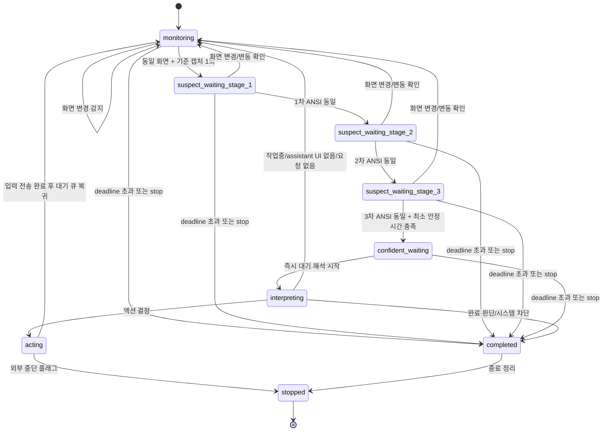
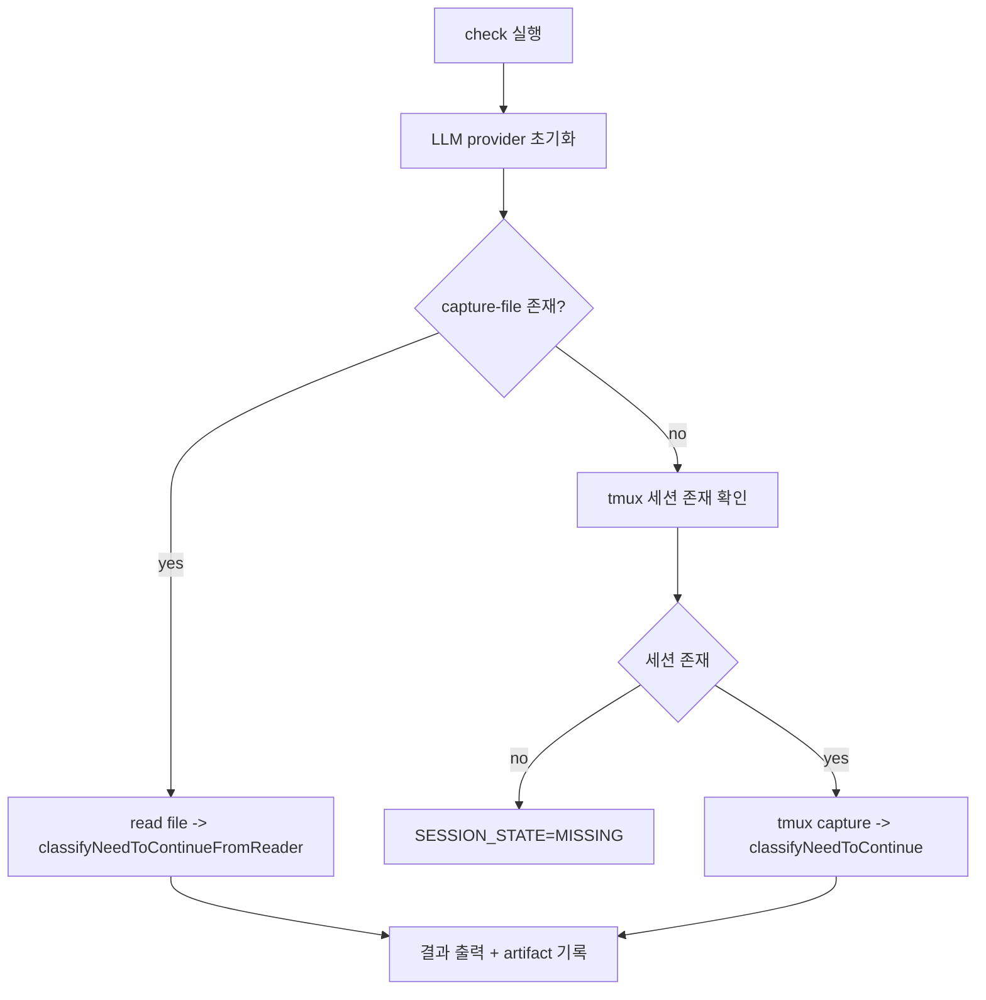
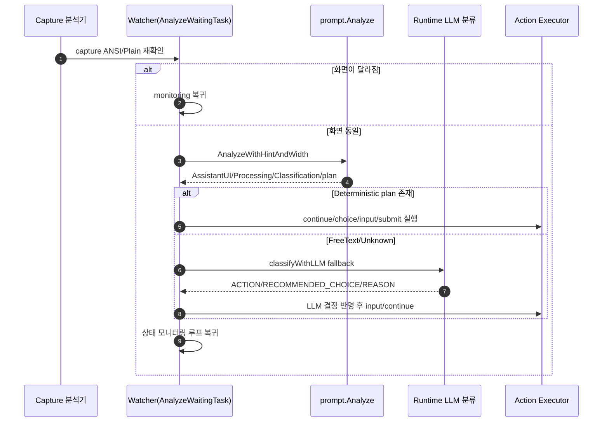
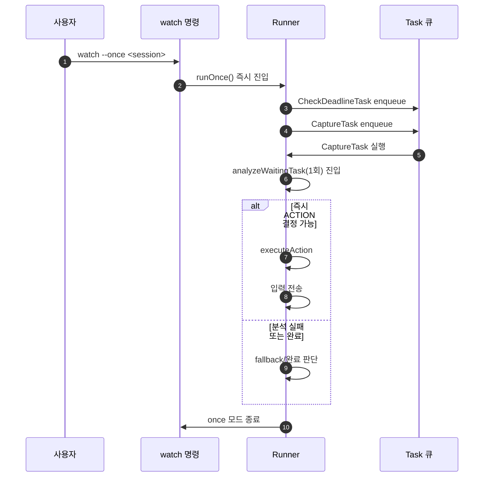

# yollo 실행 동작 정리

본 문서는 현재 코드 기준(`2026-03-14`)으로 동작을 상세 정리한다.

## 1) 진입점

- `main.go`에서 `cmd.Execute()`를 호출해 CLI를 시작한다.
- 실제 명령은 `cmd/root.go`에 등록된 하위 커맨드로 동작한다.
  - `watch [SESSION_NAME]`
  - `check [SESSION_NAME]`

## 2) 공통 설정(Flags / Env)

`watchConfig`/`loadConfig`가 아래 값을 조합해 런타임 설정을 만든다.

- 대상
  - `--target/-t`, `TMUX_SESSION`
  - 기본값: 빈 경우 `dev-pdf-codex`
- 감시 주기
  - `--interval-seconds` (기본 4)
  - `--suspect-wait-seconds-1/2/3` (각각 기본 4)
  - `--duration-seconds` (기본 86400 = 24h)
- 캡처
  - `--capture-lines` (기본 25)
  - `--capture-with-ansi` (기본 true)
- 계속 입력
  - `--continue-message`
  - `--submit-key`, `--submit-key-fallback`, `--submit-key-fallback-delay`
- LLM
  - `--llm`, `--llm-model`, `--fallback-llm`, `--fallback-llm-model`
  - `--policy`
- dry-run
  - `--dry-run`
  - `--format` (`plain`, `json`, `yaml`)
- 기타
  - `--state-dir`, `--log-file`, `--once`

`loadConfig`는 viper 기본값/환경변수(`TMUX_YOLO_*`)와 CLI 플래그를 병합한다.

`watch`는 `--once` 여부로 한 번 실행 모드인지 `Runner.Run`/`Runner.RunOnce`를 분기한다.

## 3) check 모드 실행 흐름

### 공통
- `initCheckProvider`가 주 LLM(및 fallback LLM)을 순차로 초기화/검증한다.
- 세션 상태 확인(`checkTmuxSessionState`)이 실패하면 오프라인 판단 폴백.

### 오프라인(`--capture-file`)
1. 지정 파일을 읽어 `captureText` 확보.
2. 터미널 출력 정리:
   - `stripANSICodes()`로 ANSI 제거(필요 시)
   - `stripCodexFooterNoise()`로 하단 푸터 노이즈 제거 시도
3. `classifyNeedToContinueFromReader()` 호출
4. 판정 결과를 표준출력으로 내보내고 파일 아티팩트 기록.

### 온라인(`tmux`)
1. 세션 존재 여부 확인(`HasSession` 폴백 포함)
2. pane 캡처 (`CapturePane`)
3. `classifyNeedToContinue()`로 판정 실행
4. 결과 출력

## 4) watch 모드 파이프라인 개요

`cmd/watch`는 `runtime.New`로 `Runner`를 만들고, 기본적으로:

```text
Runner.Run() -> enqueue(CheckDeadlineTask, CaptureTask) -> 큐 실행
```

`Runner`는 다음 핵심 상태/입력을 가진다.

- 상태: `monitoring`, `suspect_waiting_stage_1..3`, `confident_waiting`, `interpreting`, `acting`, `completed`, `stopped`
- `queue`: Task 목록
- `continueSentCount` + `continueStrategy`
- 화면 안정성 히스토리(`ansiHistory`, `screenHistory`)
- `primary/fallback` LLM 캐시
- tmux client, capture fetcher, action executor

## 5) Task 큐 동작(실행자)

핵심 Task는 다음이다.

- `CheckDeadlineTask`
- `CaptureTask`(= `baseCaptureTask`)
- `CompareCaptureTask`(= `ansiRecheckTask`)
- `InterpretWaitingStateTask`(= `analyzeWaitingTask`)
- `SleepTask`

실행 순서는 `enqueue`로 관리된다.

### 5.1 상태 머신(요약)

- 시작: `monitoring`
- 변경 없는 화면이면 `suspect_waiting_stage_1/2/3`
- 조건 충족 시 `confident_waiting`
- `confident_waiting`에서 prompt 분석 실패/완화 조건 발생 시 `interpreting`
- 분석/판정 중: `interpreting`
- 입력 주입 직전: `acting`
- `acting` 성공 시 `monitoring`으로 복귀, `completed` 또는 `stopped`로 종료



### 5.2 `baseCaptureTask`
- dual capture(`ANSI`, `plain`) 수행
- `prompt.AnalyzeWithHint` 및 `screenSummary` 갱신
- 분기:
  - 첫 캡처: 저장 후 `SleepTask(baseInterval)` 재대기
  - 인터랙티브 프롬프트가 감지되면 안정성 판단을 우회하고 곧바로 `analyzeWaitingTask`
  - 화면이 바뀐 경우: 기준 캡처 갱신 후 재모니터링
  - 동일 화면이 오래 지속되면 즉시 `analyzeWaitingTask`(force)
  - 기본: `stateSuspectWaiting1` + 1차 재확인 대기

### 5.3 `ansiRecheckTask(stage=1/2/3)`
- 같은 방식 dual capture
- 안정성 판단:
  - 변경 감지 -> 모니터링 복귀
  - 인터랙티브 우회 조건 충족 -> 분석으로 직행
  - 장기 안정성 조건 충족 -> `analyzeWaitingTask{forceInput:true}`
  - 아직 충분한 시간 미도달: 다음 stage 대기(각 suspect 간격 적용)
  - `elapsed >= minStableWaitingDuration()`면 `confident_waiting`

`minStableWaitingDuration` = `max(base + suspect1 + suspect2 + suspect3, 16s)` 또는 최소값.

현재 코드 기본값은 4초 계단이므로 기본 안정성 대기시간은 16초입니다. (`4+4+4+4`)

### 5.4 `analyzeWaitingTask`
- 현재 화면을 다시 capture하고 `referenceANSI`와 비교
- 화면 변동이 크면 분석 취소 후 모니터링 복귀
- `allowVolatileANSI`면 prompt zone fingerprint로 보정 허용
- prompt 분석을 받아 아래 분기로 결정
  - `!AssistantUI`: 진행하지 않음(모니터링 복귀)
  - `Processing` 감지: 진행이면 복귀
  - Copilot slash-command 상태 감지: clear 후 복귀
  - `hasPendingPromptInput`: submit-only
  - deterministic plan 존재: 결정적 액션 실행
  - 그 외(`ClassFreeTextRequest`,`ClassUnknownWaiting`): LLM fallback 분류
  - 기본 미분류: continue 주입

## 6) Prompt 분석 엔진(pipeline)

모듈: `internal/prompt`

- `AnalyzeWithHintAndWidth(ansi, plain, paneWidth)`가 동작
- 전문가 체인(expert)
  1. provider 탐지
  2. prompt line 탐지
  3. active/placeholder 탐지
  4. assistant UI 신호
  5. output block 추출
  6. processing 판단
  7. classification
  8. interactive prompt 판정

지원 분류
- `continue_after_completion`
- `free_text_request`
- `numbered_multiple_choice`
- `cursor_based_choice`
- `completed_no_further_action`
- `unknown_waiting`

분류 후 `deterministicRequirementFromAnalysis`가 조건을 만족하면:
- continue
- 번호 선택
- cursor 기반 선택
- free-text(플래너 기반 프롬프트 생성) 의사결정을 생성한다.

`promptZone` fingerprint는 `PromptZoneFingerprint`로 계산되어 우회/안정성 로직에 사용한다.

## 7) 결정 정책(Policy)와 continue 메시지

- 정책 인터페이스: `internal/policy/policy.go`
- 기본 내장 정책: `default`, `poc-completion`, `aggressive-architecture`, `parity-porting`, `creative-exploration`
- continuation 규격
  - `BasePrompts`: 매 continue마다 순환
  - `AuditPrompts`: 감사형 문구
  - `AuditEvery`: 몇 번째 continue마다 감사 메시지로 전환하는 주기
- `newContinueStrategyWithPolicy`가 정책을 주입받아 `messageFor`/`nextAuditIn` 계산

현재 구현값: `DefaultAuditEvery = 20`

## 8) action 전송 계층

- 결정 실행은 `actionExecutor` 인터페이스로 추상화
- provider별 프로파일
  - copilot / codex / gemini / glm / default
- 공통 전송 primitive:
  - continue: `C-u`(옵션), 텍스트 타이핑, 제출키, fallback 키 재전송
  - choice: 숫자 입력 + 제출
  - cursor choice: 방향키 이동으로 항목 가리기 후 Enter
  - input: 문자열 입력 + 제출
  - submit-only / clear prompt
- 기본 action mapping
  - `ActionContinue` → `injectContinue`
  - `ActionChoice` → `injectChoice`
  - `ActionCursorChoice` → `injectCursorChoice`
  - `ActionInputText` → `injectContinue` 또는 `injectInput`
- `--dry-run`이 활성화되면 `dryRunActionExecutor`를 사용한다.
  - tmux 세션에 실제로 키를 전송하지 않는다.
  - 실행 의도와 키 계획을 로그로만 출력한다.
  - 지원 포맷: `plain`, `json`, `yaml` (`--format`)
  - 출력 필드: `mode`, `provider`, `target`, `action`, `intent`, `choice`, `input`, `keys`, `notes`, `submit_key`, `fallback_submit_key`, `clear_before_typing`

`inject*`는 수행 후 `prevBase`를 초기화하고 `sleepTask`를 예약해 다음 캡처 사이클로 복귀한다.

## 9) LLM fallback 체인

- 런타임 내 lazy init
  - `getPrimaryProvider` -> `initializeProvider`
  - 필요 시 `getFallbackProvider` 사용
- provider 초기화 실패/실패한 LLM은 캐시(`primaryInitErr`, `fallbackInitErr`) 후 다음 라운드에서 재사용
- 판정 파싱 흐름(기본)
  - 프롬프트 구성(`classifyWithLLMFallback`)
  - `provider.RunPrompt(...)`
  - `ACTION/RECOMMENDED_CHOICE/CONTINUE_MESSAGE/REASON` 파싱
  - `SKIP`/`WORKING`일 경우 안전하게 continue로 폴백

## 10) check 모드의 판정 텍스트 처리

`classifyNeedToContinueFromReader`는 capture 텍스트를 정리한 뒤:
1. 빈 텍스트면 `SKIP/EMPTY`
2. 파일명이 `*.completed` 패턴이거나 `*.completed.<확장자1>[.<확장자2>]` 형태면 완료 처리로 즉시 반환(현재 구현에서는 최대 2개의 추가 확장자까지 허용)
3. `provider.IsProgressingCapture`로 `WORKING` 판정
4. 그 외 LLM 프롬프트를 통해 6-line 판단
5. `ACTION`/`STATUS` 보정과 `RECOMMENDED_CHOICE` 정규화

`isContinuationReadySignal`이 잡히면 일부 경우 `WORKING -> COMPLETED` 보정.

## 11) 관측성(UI/로그)

- UI: Bubble Tea + Lipgloss (`internal/tui/status.go`)
  - 현재 state, task, next task, sleep countdown, deadline, policy/llm 상태, 최근 이벤트 등을 카드로 표시
  - `Detail` 카드는 레이아웃이 2단이어도 항상 화면 너비 전체를 사용하는 1칸 카드로 렌더링된다.
- 로그 버퍼: `internal/tui/log_buffer.go`
- 로그 출력: 매 로그는 타임스탬프를 붙여 파일(`watch.log`) + `LogBuffer` 저장

## 12) 자동 업데이트 플로우

- `watch` 실행 시 자동 업데이트가 기본 활성화되어 런타임 진입 전에 업데이트를 시도한다.
- `--disable-auto-update` 또는 `TMUX_YOLO_DISABLE_AUTO_UPDATE=true`로 비활성화할 수 있다.
- 순서는 `runWatch -> applyAutoUpdate -> SelfUpdate`이다.
- 갱신 판단 규칙:
  - GitHub `/repos/{owner}/{repo}/releases/latest` API 조회
  - `tag_name` 비교로 최신 여부 판단
  - 현재 플랫폼 매칭:
    - 에셋 이름이 `yollo_<version>_<os>_<arch>_<variant>.tar.gz` 형식일 때 현재 `GOOS/GOARCH/Variant`에 정합해야 함
  - 일치 에셋이 있으면 다운로드 후 바이너리 교체 및 현재 프로세스 재시작
  - 최신이 아니면 다음 단계로 진행(업데이트 생략)
- 지원 형식:
  - `tar.gz`: 내부에서 `filepath.Base(entry)==appName`인 바이너리 추출
  - `zip`: 내부에서 `appName` 또는 `appName.exe` 추출
  - 그 외는 단일 바이너리로 간주해 바로 저장
- 구성:
  - 플래그: `--disable-auto-update`, `--github-repo`, `--github-token`, `--auto-update-retry-count`, `--auto-update-retry-delay`, `--auto-update-require-checksum`
  - env: `TMUX_YOLO_DISABLE_AUTO_UPDATE`, `TMUX_YOLO_GITHUB_REPO`, `TMUX_YOLO_AUTO_UPDATE_RETRY_COUNT`, `TMUX_YOLO_AUTO_UPDATE_RETRY_DELAY`, `TMUX_YOLO_AUTO_UPDATE_REQUIRE_CHECKSUM`, `GITHUB_TOKEN`

## 12) 산출물(artifact)

`state-dir` 하위에 다음이 기록된다.

- `captured/*.ansi.txt`
- `captured/*.plain.txt`
- `captured/*.json` (action 분석 메타 포함)
- check용
  - `capture-<ts>.txt`, `prompt-<ts>.txt`, `decision-<ts>.txt`
  - 세션 존재 판별 프롬프트/결과: `session-state-prompt-...`, `session-state-...`

## 13) 동작 다이어그램

### 13.1 Watch 동작(개념 시퀀스)

```mermaid
sequenceDiagram
    autonumber
    participant U as 사용자 터미널
    participant W as watch 명령
    participant R as Runner
    participant F as Capture Fetcher
    participant A as Action Executor

    U->>W: watch --once x / 기본 실행
    W->>R: New(config, tmuxClient)
    R->>R: enqueue CheckDeadlineTask, CaptureTask
    loop queue
      R->>R: dequeue task
      alt CaptureTask
        R->>F: CaptureDual(ANSI/plain)
        R->>R: prompt 분석 + screen 요약
        alt 화면이 변경됨
          R->>R: 모니터링 유지
        else 화면 안정성 높음
          R->>R: CompareCaptureTask stage 진행
        else 인터랙티브 감지/장기 정지
          R->>R: InterpretWaitingStateTask
      end
      alt InterpretWaitingStateTask
        R->>F: CaptureDual + 재확인
        R->>R: prompt 분석
        alt deterministic 결정 존재
          alt dry-run 아님
            R->>A: continue/choice/input/submit 수행
          else dry-run
            R->>A: action plan 출력
          end
        else free-text/unknown
          R->>R: LLM classify
          R->>A: LLM 결정대로 입력
        end
      end
      alt SleepTask
        R->>R: 대기(진동)
      end
    end
```

### 13.2 `check` 모드(개념 시퀀스)



### 13.3 wait-task 상태/행동 결정 시퀀스



### 13.4 `--once` 단발 실행 시퀀스



### 13.5 Task 큐 전환(개념)

```mermaid
flowchart TD
    Start([Runner 시작]) --> C[CheckDeadlineTask]
    C --> P[CaptureTask]
    P -->|변경 없음| D1[CompareTask(1차)]
    P -->|변경 감지| W[재대기 Sleep]
    P -->|interactive 감지/오래 정지| I[InterpretWaitingStateTask]
    D1 -->|미변경| D2[CompareTask(2차)]
    D1 -->|변경 감지| W
    D2 -->|미변경| D3[CompareTask(3차)]
    D2 -->|변경 감지| W
    D3 -->|미변경| I
    D3 -->|변경 감지| W
    I -->|LLM/행동 필요| A[ActionTask]
    I -->|대기 조건 미충족| W
    A --> W
    W --> P
    W --> S[종료]
    C --> S
    I --> S
```

### 13.6 Action Dry-Run 출력 예시

```text
[dry-run] mode=dry-run provider=codex target=dev-pdf-codex action=input
[dry-run] intent=send free text input clear_before_typing=true submit=C-m fallback=
[dry-run] input="테스트 계속해줘"
[dry-run] keys=C-u, submit:C-m
```

## 14) 구현상의 주의점

- 구현 기준 기준선
  - 안정성 기본 간격: `4+4+4+4`로 기본 16초
  - 감사 메시지 주기: 기본 20회마다 감사형 프롬프트로 전환 (`AuditEvery=20`)
- check 모드의 `.completed` 파일명 단축 로직은 편의적이나 이름 규칙 충돌 가능성 존재
